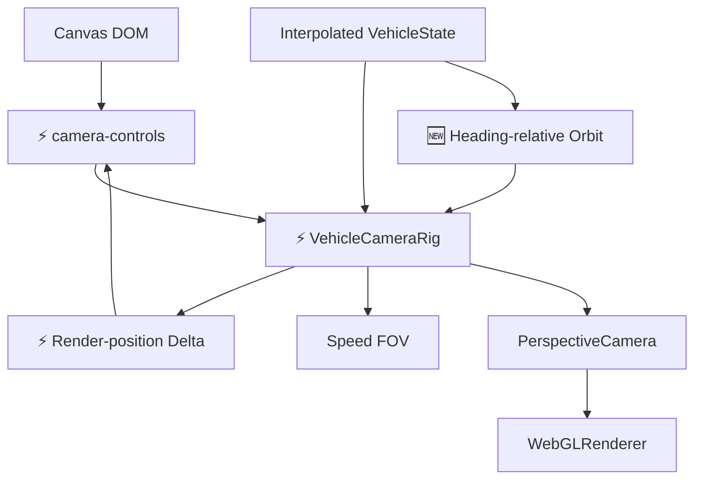
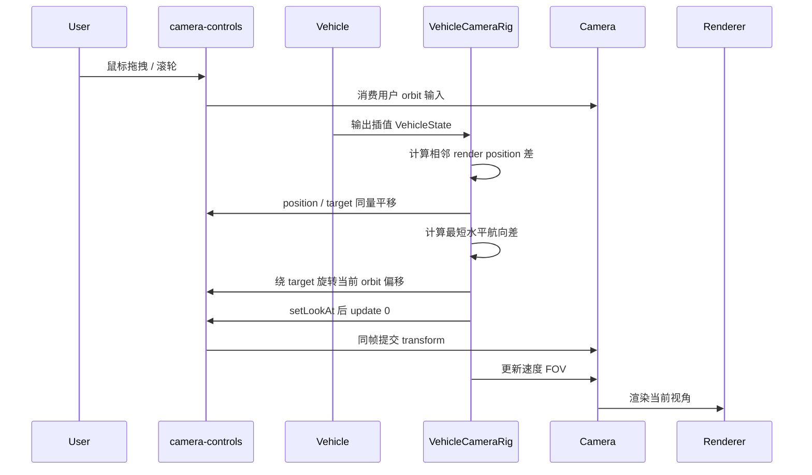

# 相机系统原理文档

## 1. 架构设计



## 2. 模块设计

| 模块 | 职责 | 输入 | 输出 |
|------|------|------|------|
| `VehicleCameraRig` | ⚡ 协调插值后载具状态与 camera-controls 用户观察 | render `VehicleState`、render `dt`、DOM pointer | Camera transform 与反馈诊断 |
| `camera-controls` | ⚡ 统一管理鼠标旋转、缩放、平移、阻尼和相机内部状态 | Canvas pointer / wheel、`dt` | Camera position / target |
| `Experience` | ⚡ 将插值 render state 与 render delta 交给车辆相机 rig | render `VehicleState` | 当前视角 |

## 3. 核心原理

- ⚡ 项目以 `camera-controls` 替换 Three examples 的 `OrbitControls`，不再维护两套相机控制状态。
- ⚡ 鼠标固定用于自由观察，不输入飞车转向，避免视角与载具姿态控制冲突。
- ⚡ 自动跟随直接使用相邻两帧插值载具姿态的位置差，并通过 camera-controls 的 position / target API 对相机和目标应用同量平移；车辆与相机不再经过两套位置响应曲线。
- ⚡ 用户当前的绕车角度、缩放和平移偏移仍由 camera-controls 保留；航向与 FOV 继续独立平滑。
- ⚡ 鼠标水平与垂直 orbit 使用 `1.6` 旋转倍率；旋转位移增益与 `smoothTime` 分开配置，灵敏度调整不改变阻尼尾迹。
- 🆕 相机只读取 previous/current 插值得到的 render state，不直接跟随离散 simulation state。
- ⚡ 不再对位置增加二次阻尼或速度前视补偿，避免可变 render delta 下相机到车辆的屏幕深度前后摆动。
- ⚡ `setLookAt(..., false)` 后必须在同一渲染帧执行 `camera-controls.update(0)`，确保控制器新姿态立即写入 Three.js camera，而不是延迟到下一帧。
- 🆕 速度从巡航到高速区间时，FOV 在 `64–74°` 间平滑变化；`R` 重置时恢复 `64°`。
- 🆕 相机只跟随载具水平航向，不跟随俯仰和视觉侧倾；用户选定的 orbit 观察角会相对车身航向保持。
- 🆕 `R` 使用当前载具航向旋转默认后上方偏移，始终回到车尾观察，而不是世界固定 `+Z`。
- ⚡ 默认 target 高度保持车身中心上方 `0.35`，核心驾驶相机偏移收近为 `(0, 2.25, 9.5)`，让 AE86 在无环境画面中保持主体比例。
- 🆕 `R` 用于将 orbit 相机重置到飞车附近。

## 4. 核心数据结构

```typescript
interface VehicleCameraRigSettings {
  minDistance: number
  maxDistance: number
  targetOffset: Vector3
  initialOffset: Vector3
  baseFov: number
  maxFov: number
  fovSharpness: number
  headingSharpness: number
}
```

## 5. 业务流程



## 6. 核心伪代码

```text
function 每帧更新相机():
    1. 让 camera-controls 消费用户鼠标输入
    2. 计算当前与上一帧插值载具位置之差
    3. target 和 camera 同步应用该 render-space 位移
    4. 按最短角度平滑跟随载具水平航向，并旋转当前 orbit 偏移
    5. setLookAt 后以 update 0 在当前帧提交 camera transform
    6. 按速度平滑更新 FOV

function 重置相机():
    1. 将 target 放到飞车车身中心附近
    2. 用当前水平航向旋转默认偏移，将 camera 放到车尾后上方
    3. 保存当前插值载具位置并恢复基础 FOV
    4. 同帧同步 camera-controls 与 Three.js camera
```
