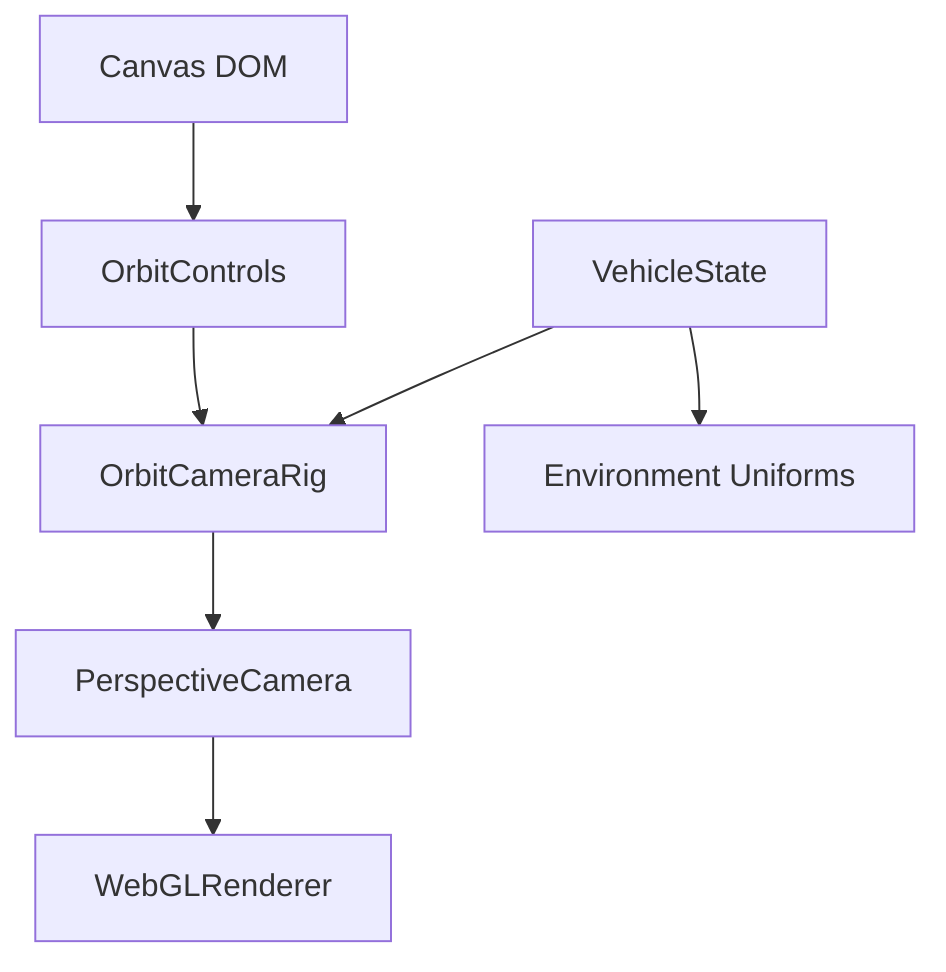
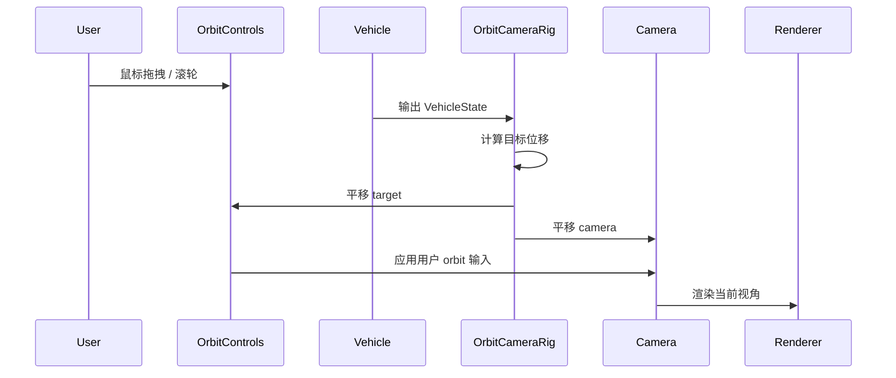

# 相机系统原理文档

## 1. 架构设计



## 2. 模块设计

| 模块 | 职责 | 输入 | 输出 |
|------|------|------|------|
| `OrbitCameraRig` | 围绕飞车自由观察，并跟随移动目标 | `VehicleState`、DOM pointer | Camera transform |
| `OrbitControls` | 鼠标旋转、缩放、平移 | Canvas pointer / wheel | Camera orbit state |
| `Experience` | 固定使用 orbit 相机更新路径 | `VehicleState` | 当前视角 |

## 3. 核心原理

- ⚡ 项目只保留 `OrbitControls` 视角，不再提供其他相机模式切换。
- ⚡ 鼠标固定用于自由观察，不输入飞车转向，避免视角与载具姿态控制冲突。
- ⚡ Orbit target 每帧跟随飞车位置，同时 target 和 camera 使用完整目标位移同步平移，保留用户当前绕车角度。
- ⚡ 默认 target 高度改为车身中心上方 `0.35`，默认相机偏移改为 `(0, 2.7, 13.5)`，让低角度太阳落在首屏右上区域。
- 🆕 `R` 用于将 orbit 相机重置到飞车附近。

## 4. 核心数据结构

```typescript
interface OrbitCameraSettings {
  minDistance: number
  maxDistance: number
  enableDamping: boolean
  targetOffset: Vector3
  initialOffset: Vector3
}
```

## 5. 业务流程



## 6. 核心伪代码

```text
function 每帧更新相机():
    1. 计算上一帧目标位置到当前飞车目标位置的完整位移
    2. target 和 camera 同步平移该位移
    3. 让 OrbitControls 应用用户鼠标输入
    4. 保持用户自定义旋转和缩放

function 重置相机():
    1. 将 target 放到飞车车身中心附近
    2. 将 camera 放到 target 后上方
    3. 更新 OrbitControls
```
