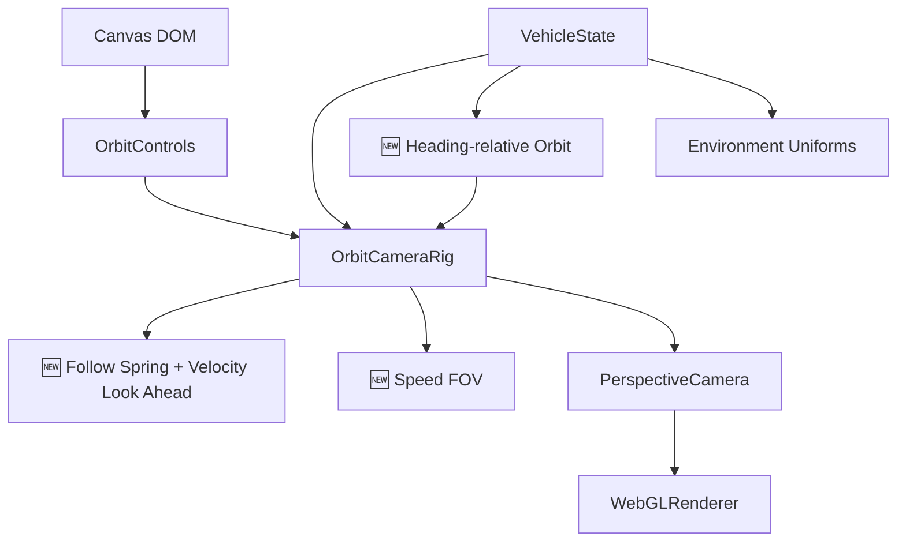
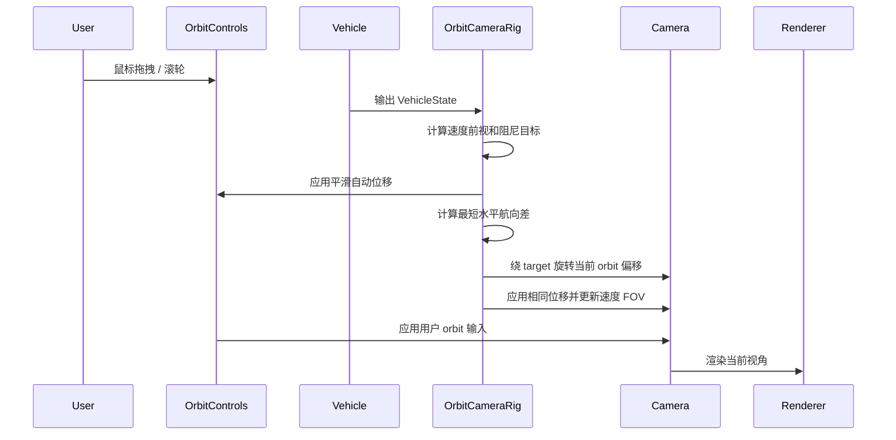

# 相机系统原理文档

## 1. 架构设计



## 2. 模块设计

| 模块 | 职责 | 输入 | 输出 |
|------|------|------|------|
| `OrbitCameraRig` | 围绕飞车自由观察，并提供速度相关的自动跟随反馈 | `VehicleState`、`dt`、DOM pointer | Camera transform 与反馈诊断 |
| `OrbitControls` | 鼠标旋转、缩放、平移 | Canvas pointer / wheel | Camera orbit state |
| `Experience` | 固定使用 orbit 相机更新路径 | `VehicleState` | 当前视角 |

## 3. 核心原理

- ⚡ 项目只保留 `OrbitControls` 视角，不再提供其他相机模式切换。
- ⚡ 鼠标固定用于自由观察，不输入飞车转向，避免视角与载具姿态控制冲突。
- ⚡ 自动目标由载具位置、车身高度偏移和速度方向前视组成，通过帧率无关阻尼形成加减速与转向惯性。
- ⚡ `OrbitControls.target` 和 camera 只接收相同的平滑自动位移，用户当前的绕车角度、缩放和平移偏移仍被保留。
- 🆕 速度从巡航到高速区间时，FOV 在 `64–74°` 间平滑变化；`R` 重置时恢复 `64°`。
- 🆕 相机只跟随载具水平航向，不跟随俯仰和视觉侧倾；用户选定的 orbit 观察角会相对车身航向保持。
- 🆕 `R` 使用当前载具航向旋转默认后上方偏移，始终回到车尾观察，而不是世界固定 `+Z`。
- ⚡ 默认 target 高度改为车身中心上方 `0.35`，默认相机偏移改为 `(0, 2.7, 13.5)`，让低角度太阳落在首屏右上区域。
- 🆕 `R` 用于将 orbit 相机重置到飞车附近。

## 4. 核心数据结构

```typescript
interface OrbitCameraSettings {
  minDistance: number
  maxDistance: number
  enableDamping: boolean
  targetOffset: Vector3
  initialOffset: Vector3
  baseFov: number
  maxFov: number
  followSharpness: number
  fovSharpness: number
  headingSharpness: number
}
```

## 5. 业务流程



## 6. 核心伪代码

```text
function 每帧更新相机():
    1. 按速度方向生成有上限的前视距离
    2. 用指数阻尼逼近飞车位置、车身高度和前视组成的目标
    3. target 和 camera 同步应用本帧自动位移
    4. 按最短角度平滑跟随载具水平航向，并旋转当前 orbit 偏移
    5. 按速度平滑更新 FOV
    6. 让 OrbitControls 应用用户鼠标输入并保留当前相对构图

function 重置相机():
    1. 将 target 放到飞车车身中心附近
    2. 用当前水平航向旋转默认偏移，将 camera 放到车尾后上方
    3. 清除前视并恢复基础 FOV
    4. 更新 OrbitControls
```
