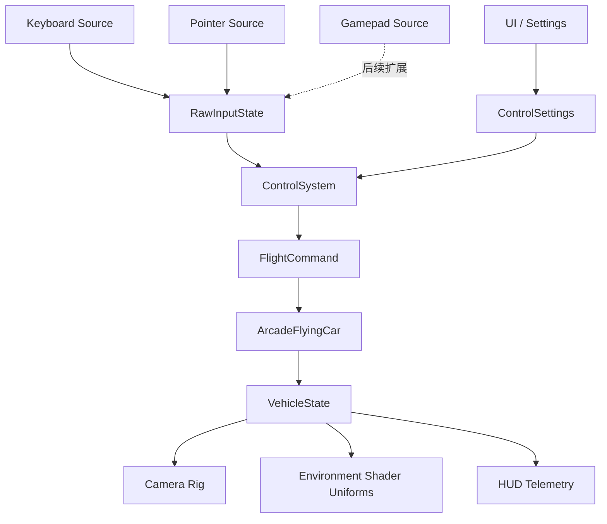
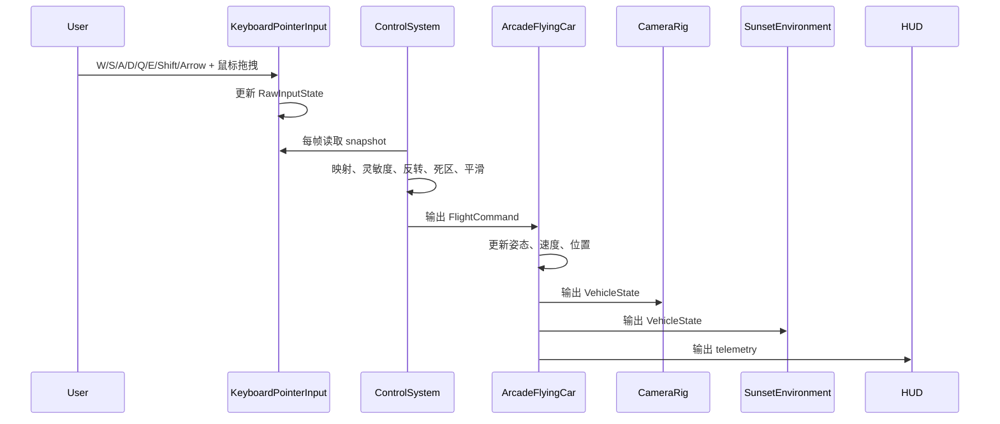

# 控制系统原理文档

## 1. 架构设计



## 2. 模块设计

| 模块 | 职责 | 输入 | 输出 |
|------|------|------|------|
| `KeyboardPointerInput` | 监听键盘和鼠标拖拽，维护原始输入 | DOM / Window events | `RawInputState` |
| `ControlSystem` | 把原始输入转换为稳定飞行命令 | `RawInputState`、`ControlSettings`、`dt` | `FlightCommand` |
| `ControlSettings` | 描述灵敏度、反转、平滑、死区 | 用户配置 / 默认配置 | 控制参数 |
| `ArcadeFlyingCar` | 消费飞行命令并更新飞车状态 | `FlightCommand`、`dt` | `VehicleState` |
| `HUD` | 展示速度、高度和控制反馈 | `VehicleState` | 文本状态 |

## 3. 核心原理

- 🆕 输入源只负责采集，不直接表达飞行动作，避免后续接入手柄时重写飞控。
- 🆕 `ControlSystem` 是输入与载具之间的稳定边界，负责组合键盘、鼠标和后续手柄输入。
- 🆕 `FlightCommand` 表示载具真正消费的控制语义：油门、刹车、俯仰、偏航、滚转、加速。
- ⚡ `ControlSystem` 仍支持鼠标衰减脉冲，但当前 `Experience` 禁用 pointer flight，鼠标事件只交给 `OrbitControls`。
- 🆕 飞控手感先保持 arcade：命令值在 `[-1, 1]` 内，动力学由载具模块解释，不在输入层模拟真实物理。

## 4. 核心数据结构

```typescript
interface RawInputState {
  keys: ReadonlySet<string>
  pointerDelta: {
    x: number
    y: number
  }
}

interface ControlSettings {
  pointerSensitivity: number
  keyboardSensitivity: number
  smoothing: number
  invertPitch: boolean
  deadzone: number
}

interface FlightCommand {
  throttle: number
  brake: number
  pitch: number
  yaw: number
  roll: number
  boost: boolean
}
```

## 5. 业务流程



## 6. 核心伪代码

```text
function 每帧控制更新(dt):
    1. 从输入源读取 RawInputState
    2. 将键盘按键映射为 throttle / brake / roll / yaw / pitch
    3. 仅在 pointer flight 启用时将鼠标增量映射为 yaw / pitch 脉冲；当前场景保持禁用
    4. 应用灵敏度、反转和死区
    5. 对轴向命令做平滑
    6. 输出 FlightCommand 给载具控制器

function 载具消费命令(dt):
    1. 根据 throttle / brake / boost 更新速度
    2. 根据 pitch / yaw / roll 更新本地旋转
    3. 沿车头的本地 -Z 方向推进位置
    4. 写入 VehicleState 供相机、环境和 HUD 使用
```
