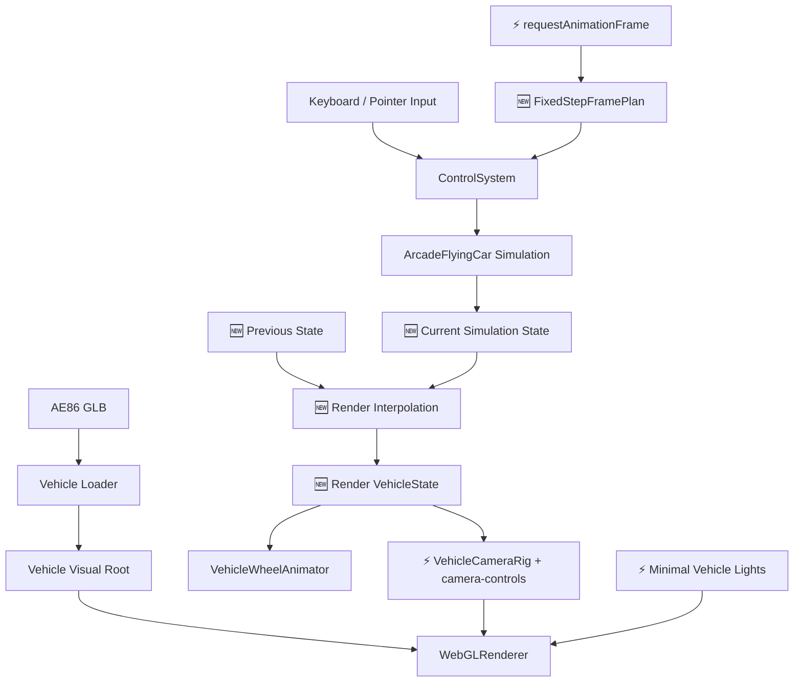
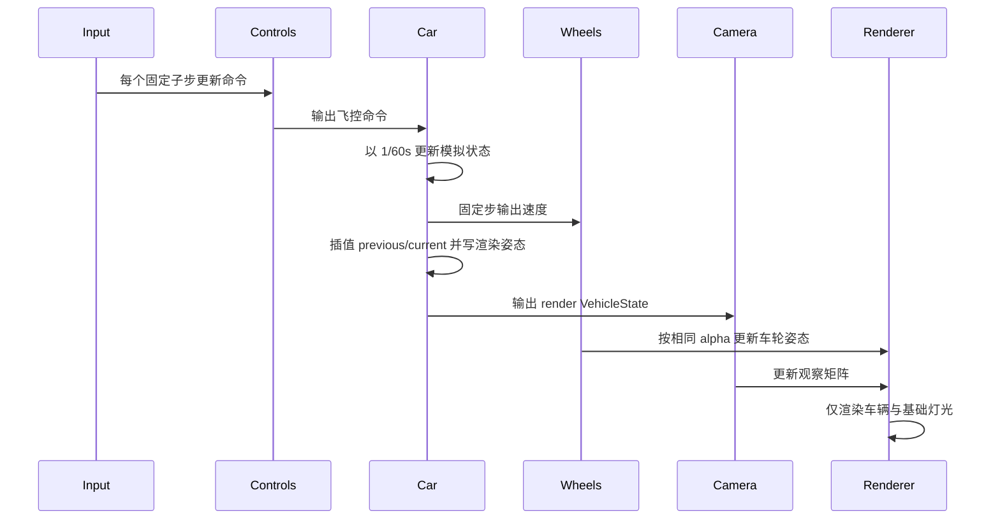

# 核心驾驶原理文档

## 1. 架构设计



## 2. 模块设计

| 模块 | 职责 | 输入 | 输出 |
|------|------|------|------|
| `Experience` | ⚡ 组装固定步模拟、车辆、控制、相机、基础灯光和渲染循环 | Canvas、车辆配置、rAF | 核心驾驶运行时 |
| `ArcadeFlyingCar` | ⚡ 计算独立模拟状态并应用插值渲染姿态 | `FlightCommand`、固定帧时、render state | `VehicleSimulationState`、Object3D pose |
| `VehicleCameraRig` | ⚡ 通过 camera-controls 跟随车辆并保留 orbit 观察 | `VehicleState`、鼠标输入 | Camera transform |
| `VehicleWheelAnimator` | ⚡ 固定步推进并按 `alpha` 插值车轮 | 车辆速度、固定帧时、`alpha` | 车轮局部姿态 |
| `loadVehicleModel` | 加载、缩放和居中 AE86 | 模型 URL | 车辆视觉节点 |

## 3. 核心原理

- 🆕 运行时边界收缩为“车 + 运动”，不再创建天空、云层、地面、建筑或程序化运动参照。
- 🆕 基础灯光只服务于车辆材质可见性，不承担场景塑造或天气效果。
- ⚡ 控制、车辆和车轮使用固定 `1/60s` 模拟；渲染插值 previous/current，camera-controls 复用 render state 的逐帧位移并在同一帧提交相机姿态。
- ⚡ 车辆运动根节点与视觉根节点继续分离，异步加载模型不会影响控制状态。
- ⚡ 诊断只报告运行时、相机、车辆和 renderer，不保留已删除环境的 shader 检查。
- 🆕 DPR 固定为 `1`，避免高密度屏幕在核心验证阶段产生无必要的像素负载。
- ⚡ 车尾相机收近到 `(0, 2.25, 9.5)`，让车辆在没有场景参照时保持明确的视觉主体地位。

## 4. 核心数据结构

```typescript
interface ExperienceConfig {
  vehicleId: string
  vehicleModelUrl: string
  vehicleModelYawDegrees: number
}
```

## 5. 业务流程



## 6. 核心伪代码

```text
function 更新核心驾驶帧(rawDt):
    1. 用 rawDt 与 accumulator 生成固定步 frame plan
    2. 以 1/60s 子步更新控制、车辆和车轮模拟
    3. 用 accumulator alpha 插值车辆与车轮渲染姿态
    4. 让 camera-controls 跟随插值后的车辆状态
    5. 渲染只有车辆的场景
```
