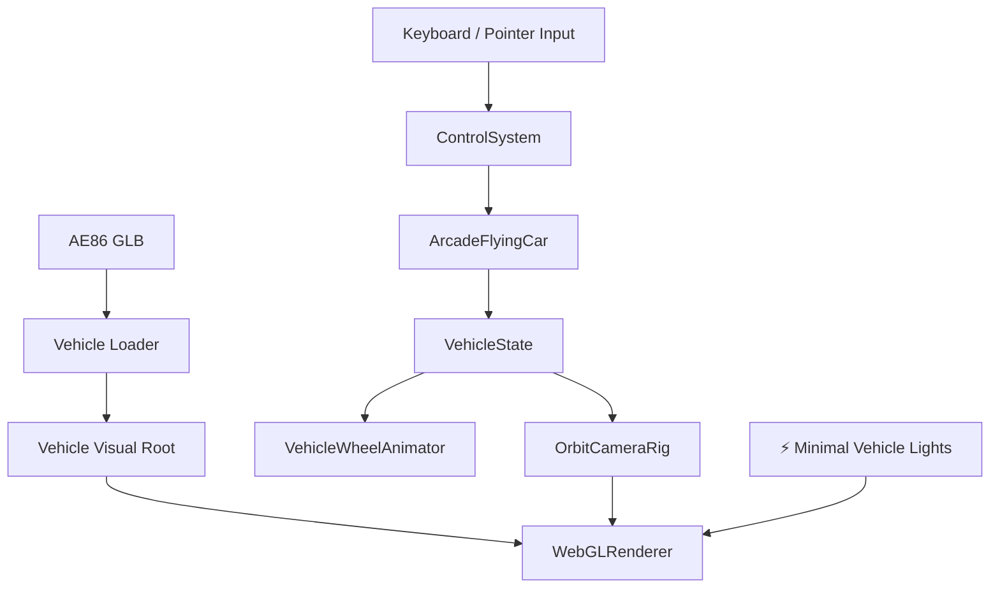
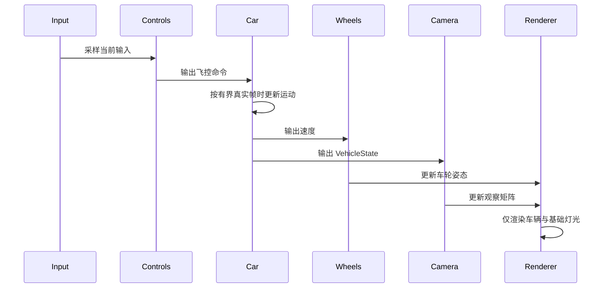

# 核心驾驶原理文档

## 1. 架构设计



## 2. 模块设计

| 模块 | 职责 | 输入 | 输出 |
|------|------|------|------|
| `Experience` | ⚡ 只组装车辆、控制、相机、基础灯光和渲染循环 | Canvas、车辆配置 | 核心驾驶运行时 |
| `ArcadeFlyingCar` | 计算速度、航向、俯仰与车身姿态 | `FlightCommand`、帧时 | `VehicleState` |
| `OrbitCameraRig` | 跟随车辆并保留 orbit 观察 | `VehicleState`、鼠标输入 | Camera transform |
| `VehicleWheelAnimator` | 按车辆线速度驱动车轮 | 车辆速度、帧时 | 车轮局部姿态 |
| `loadVehicleModel` | 加载、缩放和居中 AE86 | 模型 URL | 车辆视觉节点 |

## 3. 核心原理

- 🆕 运行时边界收缩为“车 + 运动”，不再创建天空、云层、地面、建筑或程序化运动参照。
- 🆕 基础灯光只服务于车辆材质可见性，不承担场景塑造或天气效果。
- ⚡ 渲染循环使用有界真实帧时更新控制、车辆、车轮和相机；长帧不再在 `33ms` 处直接丢弃运动时间。
- ⚡ 车辆运动根节点与视觉根节点继续分离，异步加载模型不会影响控制状态。
- ⚡ 诊断只报告运行时、相机、车辆和 renderer，不保留已删除环境的 shader 检查。
- 🆕 DPR 固定为 `1`，避免高密度屏幕在核心验证阶段产生无必要的像素负载。
- ⚡ 车尾相机收近到 `(0, 2.25, 9.5)`，让车辆在没有场景参照时保持明确的视觉主体地位。

## 4. 核心数据结构

```typescript
interface ExperienceConfig {
  vehicleId: string
  vehicleModelUrl: string
  vehicleModelYawDegrees: number
}
```

## 5. 业务流程



## 6. 核心伪代码

```text
function 更新核心驾驶帧(rawDt):
    1. 将异常长帧限制在安全上限内
    2. 采样输入并更新控制命令
    3. 用同一帧时更新车辆与车轮
    4. 让相机跟随最新车辆状态
    5. 渲染只有车辆的场景
```
