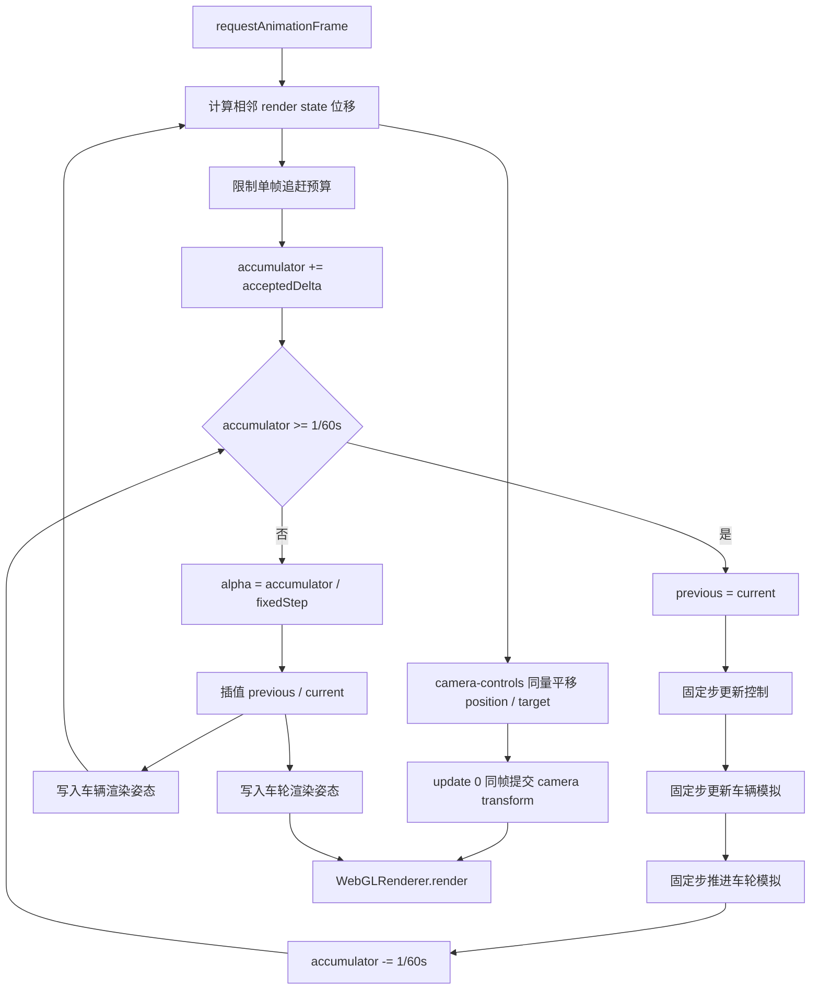
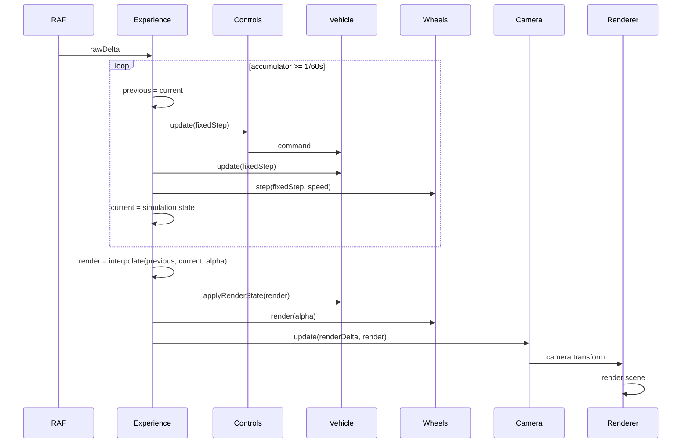

# 固定步进与渲染插值原理文档

## 1. 架构设计



## 2. 模块设计

| 模块 | 职责 | 输入 | 输出 |
|------|------|------|------|
| `fixedStep` | 🆕 纯函数计算 accepted delta、子步数、余数 `alpha` 和丢弃时间 | previous accumulator、`rawDelta`、预算 | `FixedStepFramePlan` |
| `Experience` | 🆕 执行 frame plan、快照轮换、插值和渲染顺序 | rAF `rawDelta`、输入 | simulation time、`alpha`、画面 |
| `ArcadeFlyingCar` | ⚡ 只更新独立模拟状态，并接受插值后的渲染状态 | 固定 `dt`、`FlightCommand` | current simulation state、Object3D pose |
| `vehicleState` | 🆕 创建、复制和插值完整车辆快照 | previous、current、`alpha` | render state |
| `VehicleWheelAnimator` | ⚡ 固定步推进未取模角度，渲染阶段插值并写车轮节点 | 固定 `dt`、速度、`alpha` | 平滑车轮姿态 |
| `VehicleCameraRig` | ⚡ 只消费插值后的 `VehicleState` | render state、render `dt` | camera-controls position / target |

## 3. 核心原理

- 🆕 模拟以固定 `1/60s` 步长运行，结果不再随显示帧率改变。
- 🆕 previous/current 保存模拟边界状态；渲染使用 `alpha` 插值并有意落后一个固定步，换取连续画面。
- 🆕 模拟状态不再引用 Object3D transform，渲染插值不能污染下一次物理更新。
- 🆕 单帧最多执行 `8` 个子步，可完整吸收 `100ms` 长帧，并限制标签恢复等超长暂停的追赶成本。
- ⚡ camera-controls 仍按渲染帧更新，且 position / target 直接复用 interpolated render state 的逐帧位移，不再对位置执行第二次阻尼。
- 🆕 车轮使用未取模模拟角度插值，避免高速下跨越 `2π` 时选错旋转方向。

## 4. 核心数据结构

```typescript
interface VehicleSimulationState extends VehicleState {
  visualRoll: number
  visualPitch: number
}

interface FixedStepDiagnostics {
  fixedStep: number
  accumulator: number
  interpolationAlpha: number
  lastSubstepCount: number
  simulationTime: number
  droppedTime: number
}
```

## 5. 业务流程



## 6. 核心伪代码

```text
function renderFrame(rawDelta):
    framePlan = planFixedStepFrame(accumulator, rawDelta)
    accumulator = framePlan.accumulator
    repeat framePlan.substepCount times:
        previous = current
        updateControls(fixedStep)
        updateVehicle(fixedStep)
        updateWheels(fixedStep)
        current = vehicleSimulationState
    alpha = framePlan.interpolationAlpha
    renderState = interpolate(previous, current, alpha)
    applyVehicleRenderState(renderState)
    renderWheels(alpha)
    updateCameraControls(acceptedDelta, renderState)
    commitCameraControls(0)
    render()
```
