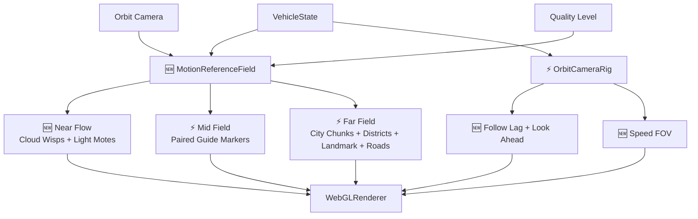
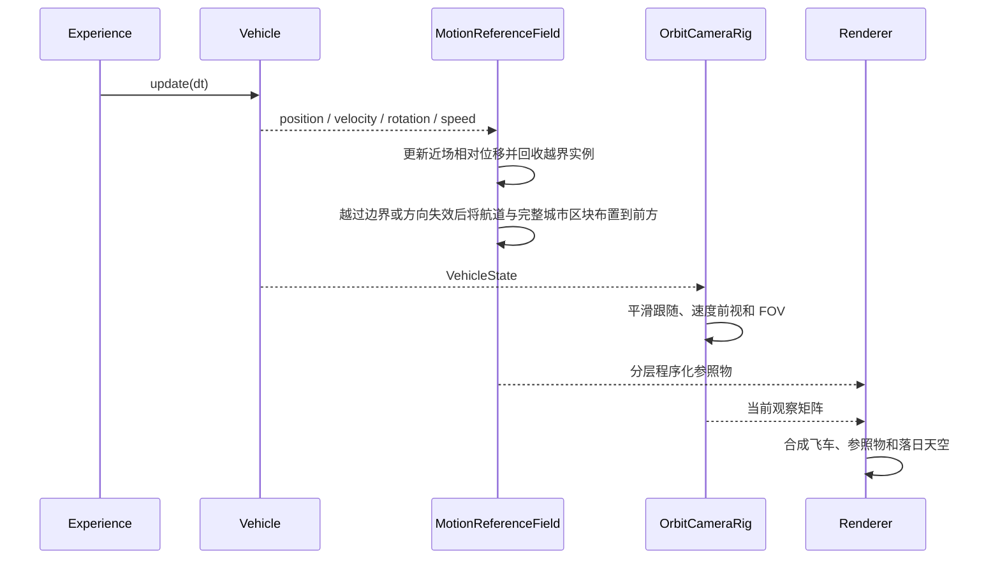

# 程序化运动参照系统原理文档

> ⚡ 2026-08-04：`MotionReferenceField` 已从核心运行时和源码中删除；本文仅保留历史设计记录。

## 1. 架构设计



## 2. 模块设计

| 模块 | 职责 | 输入 | 输出 |
|------|------|------|------|
| `MotionReferenceField` | 🆕 统一管理程序化参照物的创建、更新、回收和诊断 | `VehicleState`、相机、质量档、时间步 | 近中远三层世界参照 |
| `NearFlow` | 🆕 以固定对象池生成快速掠过的薄云丝和光点 | 载具位置、速度、朝向 | 高频周边光流 |
| `RouteField` | ⚡ 沿前进走廊循环布置成对发光短条 | 载具位置、旅行坐标系、确定性种子 | 中景尺度与路径参照 |
| `CityField` | ⚡ 用固定容量区块池管理四类街区、退台体块、GPU 立面、地标塔尖和世界坐标道路 | 载具位置、固定城市高度、旅行坐标系、时间 | 远景方向、密度层级、地标、道路、楼层和窗灯参照 |
| `OrbitCameraRig` | ⚡ 保留自由 orbit，同时增加跟随惯性、前视和速度 FOV | `VehicleState`、用户 orbit 输入 | 有加减速反馈的相机变换 |

## 3. 核心原理

- 🆕 运动感来自不同距离参照物产生的视差，而不是让天空背景整体播放更快。
- 🆕 近景、中景、远景分别承担速度、空间位移和方向尺度；任一层都不能代替另外两层。
- 🆕 高频重复元素使用 `Points` / `InstancedMesh` / 程序化材质，不为云丝、光点、航道和剪影引入 GLB。
- 🆕 所有参照物数量有固定上限；跨越回收边界后在前方重新布置，运行时不持续创建场景对象。
- 🆕 中远景在被回收前保持稳定世界位置；越过后方、距离上限或方向失效边界后，才使用确定性随机序列重新布置到前方。
- ⚡ 航道换向采用两阶段回收：先标记全部失效实例，只从有效实例计算最远前方游标；批量失效时从有界基础距离重新铺设，避免旧方向实例把生成距离持续推远。
- 🆕 近场对象池允许围绕载具维护，但对象必须表现出与 `VehicleState.velocity` 相反的相对运动，不能静止绑定相机。
- ⚡ 航道只由左右成对的发光短条构成，是视觉参照而非实体道路；不包含椭圆门、碰撞或路径约束。
- ⚡ 中景程序化云柱已移除：半透明云片纵向叠加会形成深色烟柱轮廓，并与 `SunsetEnvironment` 的体积云职责重复。
- ⚡ 云层外观统一由落日体积云负责；运动参照模块只保留低密度近场云丝，不再生成可聚成块的局部云体。
- ⚡ 相机只对自动跟随位移施加平滑和前视，用户通过 `OrbitControls` 产生的旋转、缩放和平移仍然保留。
- ⚡ 相机同步平滑跟随飞车水平航向，使近中远参照物的光流方向与屏幕转向反馈保持一致，同时不继承视觉侧倾。
- 🆕 FOV 由速度归一化结果平滑驱动；加速增强速度感，减速后恢复，避免瞬时跳变。
- 🆕 城市 V1 保留 CPU 低频生成与世界稳定回收，GPU 只生成重复度高的楼层、窗格、亮灯和立面明暗；历史剪影方案与后续路线记录在 `docs/architecture/procedural-city/README.md`。
- 🆕 城市 V2.1 冻结城市基准高度，并用随载具水平平移的覆盖平面承载世界坐标道路；建筑吸附固定街区中心，转向时道路和已生成建筑不随相机旋转。
- 🆕 城市 V2.2 将单栋回收升级为固定容量区块回收；中心、商业、住宅和地标区各自控制 CPU 体量规则，GPU 通过实例属性调整窗格与亮灯。
- ⚡ 转向失效区块采用左右独立前方游标成组回填；世界网格吸附后再次校验当前横向符号并避让同格区块，防止斜向飞行时城市偏到单侧。

## 4. 核心数据结构

```typescript
interface MotionReferenceSettings {
  moteCount: number
  wispCount: number
  markerPairCount: number
  buildingCount: number
  cityChunkCount: number
  buildingsPerChunk: number
}

interface MotionReferenceDiagnostics {
  version: string
  initialized: boolean
  speedRatio: number
  recycleCount: number
  counts: {
    near: number
    mid: number
    far: number
  }
  city: {
    chunkCount: number
    chunkRecycleCount: number
    districtCounts: Record<string, number>
    overlappingChunkPairs: number
    nonFiniteInstanceMatrices: number
  }
  routeAnchor: [number, number, number] | null
}

interface CameraMotionFeedback {
  initialized: boolean
  lookAheadDistance: number
  targetFov: number
  currentFov: number
  targetHeading: number
  followHeading: number
  headingError: number
}
```

## 5. 业务流程



## 6. 核心伪代码

```text
function 更新运动参照(dt, vehicleState):
    1. 计算载具当前前向、右向和速度比例
    2. 让近场云丝与光点按相对速度穿过观察空间
    3. 越过后方或横向边界的实例重新生成到载具前方
    4. 批量标记越过后方、距离或方向边界的航道与城市区块
    5. 排除失效区块后按左右侧计算有界前方游标，并成组重写建筑与地标实例
    6. 更新实例矩阵和材质中的时间、速度参数
    7. 城市 shader 根据稳定种子和局部坐标生成楼层、窗格、亮灯与雾融合

function 更新运动相机(dt, vehicleState):
    1. 将自动跟随目标设为载具位置、车身高度偏移和速度方向前视
    2. 用帧率无关阻尼计算自动目标位移
    3. 将相同位移应用于 OrbitControls target 和 camera
    4. 按最短角度平滑跟随水平航向并旋转当前相机偏移
    5. 保留用户当前 orbit 相对构图
    6. 按速度平滑更新 FOV
```

## 7. 城市子系统演进


- 🆕 V0 继续作为“低成本远景运动参照”的历史基线保留。
- ⚡ V1 仍由 `MotionReferenceField` 管理固定实例池，未改变运动参照模块与飞控、相机和环境的职责边界。
- 🆕 V2.1 在相同模块边界内增加一个程序化地面 draw layer；建筑实例容量不变。
- 🆕 V2.2 在相同模块边界内增加固定区块池与塔尖层；`low` 档城市固定为 `48 × 3 + 8 = 152` 个实例，总 draw layer 增至 8。
- ⚡ WebGPU compute 和 SDF 天际线属于后续阶段，不计入当前已交付能力。
