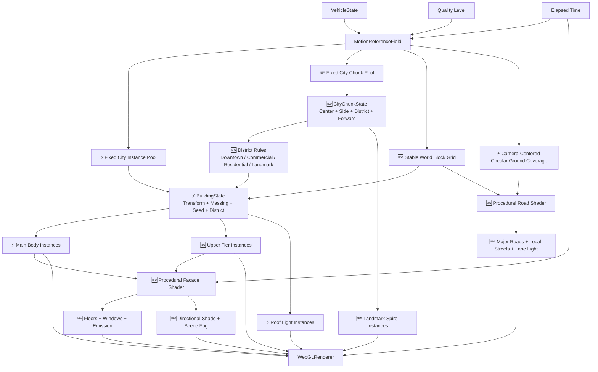
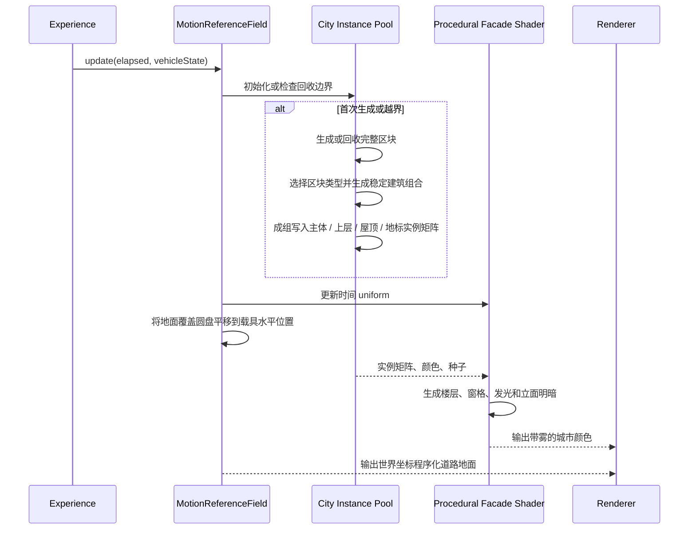

# 程序化城市原理文档

> ⚡ 2026-08-04：程序化城市、道路与对应 shader 已从核心运行时和源码中删除；本文仅保留历史设计记录。

## 1. 架构演进


- 🆕 历史方案不删除：V0 记录当前城市从低成本运动参照物起步的原因，后续版本在同一固定实例池架构上渐进增强。
- ⚡ V1、V2.1 与 V2.2 均已交付；WebGPU 与 SDF 仍按阶段保留。

## 2. 当前架构



## 3. 模块设计

| 模块 | 职责 | 输入 | 输出 |
|------|------|------|------|
| `MotionReferenceField` | ⚡ 延续现有旅行坐标系、固定容量、回收和诊断职责 | 载具状态、相机、时间、质量档 | 城市实例状态与矩阵 |
| `BuildingState` | 🆕 保存一栋建筑跨回收帧稳定的体块参数与随机种子 | 确定性随机序列 | 主体、上层和屋顶变换 |
| `City Instance Layers` | ⚡ 用共享基础几何和固定实例容量表达多段建筑 | 实例矩阵、实例颜色 | 有退台变化的城市轮廓 |
| `Procedural Facade Shader` | 🆕 在 GPU 根据局部坐标、尺寸和种子生成立面明暗、楼层与窗灯 | 实例属性、时间、雾参数 | 无外部纹理的建筑立面 |
| `Stable World Block Grid` | ⚡ 将区块中心吸附到 `640` 世界网格，并在吸附后修正左右偏侧与同格冲突 | 候选区块中心、旅行坐标系、有效区块 | 不随载具转向旋转且保持双侧分布的区块坐标 |
| `Procedural City Ground` | ⚡ 用随载具平移的有限圆盘承载世界坐标道路 shader | 载具水平位置、固定城市高度、相机位置 | 圆形边界内的主干道、支路、车道光和街区底色 |
| `City Chunk Pool` | 🆕 以固定容量区块作为生成、回收和方向失效判断单位 | 载具位置、旅行方向、区块槽位 | 成组稳定的建筑与街区生命周期 |
| `District Rules` | 🆕 为中心、商业、住宅和地标区生成不同高度、占地、灯光密度与配色 | 区块类型、局部建筑槽位、稳定种子 | 有层次的街区体块参数 |
| `Landmark Spires` | 🆕 用固定容量实例层为地标区首栋建筑增加高辨识度塔尖 | 地标楼顶位置、区块类型 | 稳定地标轮廓与远景导航点 |

## 4. 核心原理

- 🆕 现实感先来自体块比例和重复规律，再来自窗户细节；本轮用主楼体、上层退台和屋顶灯替代单一长方体。
- 🆕 CPU 继续负责低频且需要世界稳定性的生成与回收；GPU 负责每像素重复度高的楼层、窗格、明暗和发光。
- 🆕 建筑被回收前保持固定世界位置，避免随载具转向整体旋转；这也是本轮不把生成逻辑全部迁入 vertex shader 的原因。
- 🆕 每栋建筑只保存一个稳定种子，立面 shader 从种子派生窗灯分布，不为窗户创建几何体或贴图。
- 🆕 固定容量与共享几何保持不变；新增体块只增加有上限的 draw layer，不随飞行距离增长。
- 🆕 场景雾继续承担远景融合，建筑 shader 不复制天空或体积云职责。
- 🆕 V2.1 的地面几何只负责覆盖相机周边；道路图案由世界坐标计算，因此覆盖网格平移时道路不会在地面上滑动。
- ⚡ 地面覆盖由方形平面改为同直径圆盘；圆心仍跟随载具水平位置，固定圆周分段只负责平滑轮廓，不改变道路 shader 或城市网格坐标。
- 🆕 城市高度在首次初始化后固定，不继续跟随载具升降；建筑和地面共享同一基准面，避免形成高低漂移的悬浮城市。
- 🆕 建筑槽位按前向行、左右侧和横向街区带分组，再吸附到世界街区中心；内侧更高、外侧更低，形成可读密度梯度。
- 🆕 V2.2 将回收原子从单栋建筑提升为完整区块；同一区块内的道路关系、建筑组合与地标不会在不同帧被拆散重排。
- 🆕 区块池数量和每区块建筑数由质量档固定，运行时只重写既有矩阵和属性，不创建新 Mesh 或扩大实例缓冲。
- 🆕 转向时先批量标记方向失效区块，只从有效区块计算左右两侧最远前方位置，再成组铺到新方向，避免新旧城区重叠。
- 🆕 facade shader 接收区块类型属性，只改变窗格尺度、亮灯概率和地标强调，不复制 CPU 的体块规则。
- ⚡ 世界网格吸附会产生最多半个网格的二维取整误差；区块生成后按当前右向校验横向符号，必要时沿右向主世界轴平移一个网格，再沿前向主轴避让同格有效区块。
- 🆕 诊断直接读取四个实例层的矩阵，并输出区块相对前向/横向位置、方向一致度、重叠对数与非有限矩阵数，使转向流送可被数值验收。

## 5. 核心数据结构

```typescript
interface BuildingState {
  position: Vector3
  scale: Vector3
  rotation: Quaternion
  tierScale: Vector3
  seed: number
  district: CityDistrict
}

type CityDistrict = 0 | 1 | 2 | 3 // downtown / commercial / residential / landmark

interface CityChunkState {
  position: Vector3
  forward: Vector3
  landmarkTop: Vector3
  side: -1 | 1
  district: CityDistrict
  seed: number
  firstBuilding: number
  buildingCount: number
  landmarkActive: boolean
}

interface ProceduralFacadeInputs {
  instanceMatrix: Matrix4
  instanceColor: Color
  buildingSeed: number
  districtType: CityDistrict
  elapsedTime: number
  fog: SceneFog
}

interface CityGridState {
  groundY: number
  blockSize: number
  chunkSize: number
  groundCoverage: number
  groundShape: 'circle'
  groundSegments: number
}
```

## 6. 业务流程



## 7. 核心伪代码

```text
function 生成城市区块(chunk, vehicleState):
    1. 在载具前方和指定左右侧得到候选区块中心
    2. 吸附到固定 640 世界网格并校验当前横向符号
    3. 避让仍有效且占用相同世界网格的区块
    4. 根据区块类型为连续建筑槽位生成宽高深、退台、颜色和 shader 属性
    5. 将完整区块写入主体、退台、屋顶与固定塔尖实例层

function 更新城市区块(vehicleState):
    1. 批量标记越过后方、距离过远或方向失效的区块
    2. 只从有效区块计算左右两侧最远前方位置
    3. 为失效区块选择新的前方位置并复用槽位的固定街区类型
    4. 成组重写区块内全部建筑、facade 属性与可选地标塔尖
    5. 一次性提交受影响的实例缓冲更新

function 绘制程序化立面(fragment):
    1. 根据局部表面方向选择立面横向坐标
    2. 根据实例尺寸换算现实尺度的楼层和窗格
    3. 使用建筑种子与窗格编号得到稳定亮灯概率
    4. 合成立面基色、方向明暗、窗灯和屋顶明暗
    5. 应用场景雾与输出色彩空间

function 绘制城市地面(fragment):
    1. 从世界坐标计算主干道和本地街道距离
    2. 根据到相机距离淡出细街道，只保留远景主干道
    3. 合成街区底色、道路、车道光与微弱方向变化
    4. 应用场景雾与输出色彩空间
```
