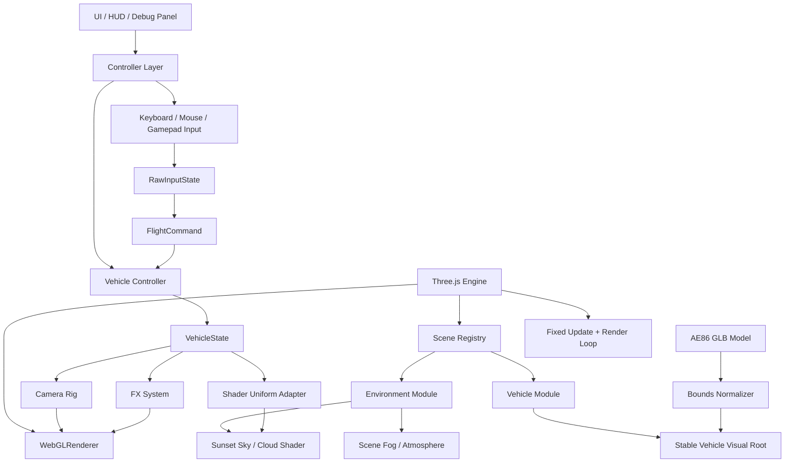
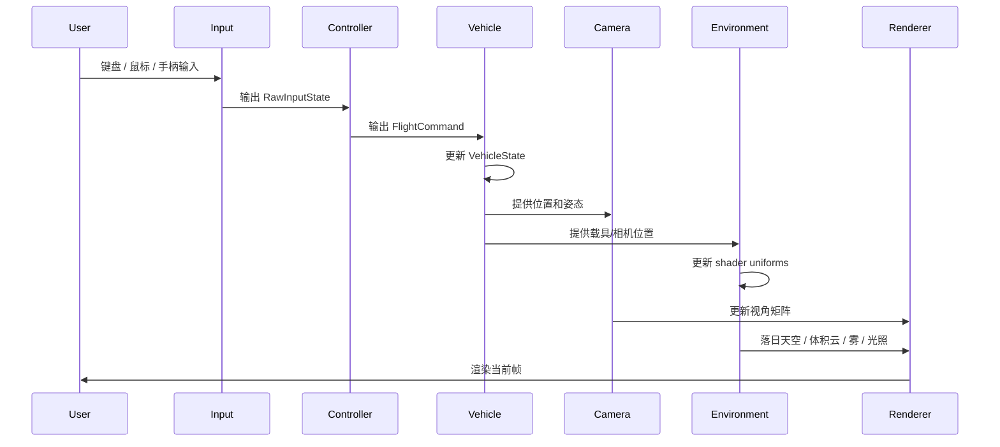

# 项目初始化原理文档

> ⚡ 2026-08-04：初始化阶段的环境架构已退出当前运行时；现行最小架构见 `docs/architecture/core-drive/README.md`。

## 1. 架构设计



## 2. 模块设计

| 模块 | 职责 | 输入 | 输出 |
|------|------|------|------|
| `engine` | 创建 renderer / scene / loop，协调模块生命周期 | DOM 容器、配置 | 渲染循环、模块更新 |
| `controls` | 采集键鼠输入并转换为飞行命令 | Keyboard / Pointer / `dt` | `RawInputState`、`FlightCommand` |
| `vehicles` | 维护飞车状态、arcade 控制、GLB 加载与视觉替换 | `FlightCommand`、`dt`、模型配置 | `VehicleState`、稳定载具根节点 |
| `camera` | OrbitControls 自由视角，并跟随飞车移动 | `VehicleState`、DOM pointer | Camera transform |
| `environments` | 落日场景、体积云、雾、太阳方向和环境光 | 时间、相机、载具状态 | 落日天空 shader、环境灯光 |
| `shaders` | 保存落日天空与体积云 GLSL | `iTime`、相机参数、太阳方向、质量档 | `ShaderMaterial` |
| `config` | 注册可切换场景和载具组合 | 用户选择、默认配置 | `ExperienceConfig` |

## 3. 核心原理

- ⚡ 当前项目以“落日飞车”shader 体验为核心，优先使用原生 Three.js，不引入 R3F。
- 🆕 R3F 适合 React 状态驱动 UI 和组件化 3D 页面；本项目更需要直接控制 shader uniforms、render loop、相机和飞行动力学。
- 🆕 飞行控制先采用 arcade 模型自研：速度、俯仰、偏航、滚转、阻尼和 boost 都可控，避免物理引擎过早约束手感。
- 🆕 依赖保持最小：`three` 运行时，`vite` / `typescript` 开发构建；控制、物理、AI 库作为后续按需扩展。
- ⚡ 默认组合为 `SunsetEnvironment + ArcadeFlyingCar + Toyota AE86`；Environment、Vehicle、Controller、CameraRig 仍保持可替换边界。
- 🆕 第三方 GLB 只作为运动根节点的视觉子节点；异步加载不会改变控制器和相机持有的 Object3D 引用。

## 4. 核心数据结构

```typescript
interface ExperienceConfig {
  environmentId: string
  environmentLabel: string
  vehicleId: string
  vehicleModelUrl: string
  vehicleModelYawDegrees: number
  quality: 'low' | 'medium' | 'high'
}

interface RawInputState {
  keys: ReadonlySet<string>
  pointerDelta: {
    x: number
    y: number
  }
}

interface FlightCommand {
  throttle: number
  brake: number
  pitch: number
  yaw: number
  roll: number
  boost: boolean
}

interface VehicleState {
  position: Vector3
  rotation: Quaternion
  velocity: Vector3
  angularVelocity: Vector3
  throttle: number
  speed: number
}

interface EnvironmentUniforms {
  iTime: number
  iResolution: Vector2
  uCameraPosition: Vector3
  vehiclePosition: Vector3
  sunDirection: Vector3
  uAtmosphereDebugMode: 0 | 1 | 2
}
```

## 5. 业务流程



## 6. 核心伪代码

```text
function 初始化项目():
    1. 创建 Three.js renderer / scene / camera
    2. 从配置选择落日 environment、飞车和模型 URL
    3. 创建稳定载具根节点与加载期占位车
    4. 异步加载、缩放并居中 AE86 GLB
    5. 初始化 input、vehicle controller、camera rig
    6. 启动 animation loop

function 每帧更新(dt):
    1. 读取输入并归一化为 RawInputState
    2. 根据 RawInputState 生成 FlightCommand
    3. 根据 FlightCommand 更新 VehicleState
    4. 根据 VehicleState 更新模型 transform
    5. 根据 VehicleState 平滑更新 CameraRig
    6. 根据时间、分辨率、相机和载具位置更新 shader uniforms
    7. 渲染 scene
```
