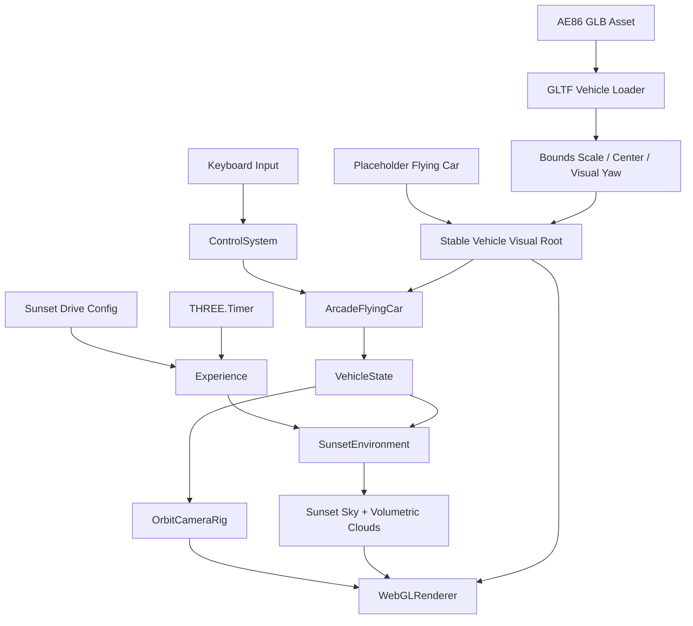
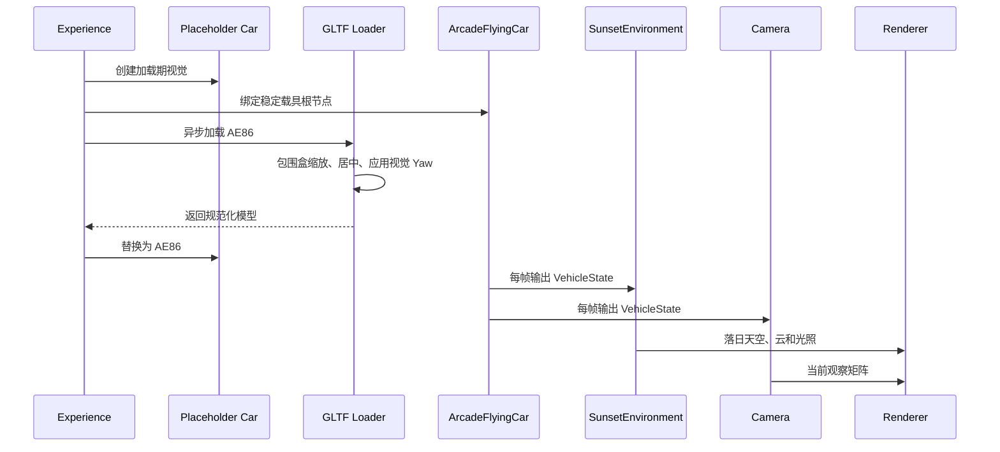

# 落日飞车场景原理文档

## 1. 架构设计



## 2. 模块设计

| 模块 | 职责 | 输入 | 输出 |
|------|------|------|------|
| `Experience` | 组装落日环境、飞车、相机、HUD 和异步资源生命周期 | `ExperienceConfig`、Canvas | 可运行场景 |
| `SunsetEnvironment` | 管理落日天空、体积云、雾和暖色环境光 | 时间、相机、载具状态、质量档 | 环境 shader 与诊断快照 |
| `ArcadeFlyingCar` | 保持六自由度 arcade 飞行手感 | `FlightCommand`、`dt` | `VehicleState` |
| `loadVehicleModel` | 加载并规范化第三方 GLB | 模型 URL、目标长度、前向约定 | 居中且尺度稳定的模型根节点 |
| `OrbitCameraRig` | 围绕飞车自由观察并跟随移动 | `VehicleState`、鼠标输入 | Camera transform |

## 3. 核心原理

- 🆕 主题从通用云端飞行切换为“落日中的 AE86 飞车”，但控制、相机和环境仍通过 `VehicleState` 解耦。
- 🆕 载具运动根节点保持稳定；占位车只作为加载期视觉，GLB 完成后替换其子节点，避免异步加载改变控制引用。
- 🆕 模型资源按 `public/models/vehicles/{vehicle}` 组织，运行时通过站点绝对路径访问；第三方许可与模型同目录保存。
- ⚡ GLB 原始单位不进入玩法层，加载器按包围盒缩放并居中；当前配置在独立视觉根节点上绕本地 Y 轴正向旋转 `135°`，不改变运动根节点与 `-Z` 推进方向。
- ⚡ 落日感由方向 `(0.32, 0.18, -0.93)` 的低角度太阳、暖色地平线、冷色高空和紫红云影共同构成，不依赖外部全景贴图。
- 🆕 体积云保留稀疏 coverage 与 Beer-Lambert 消光，避免落日染色后退化成整屏同色雾。
- 🆕 `THREE.Timer` 连接 Page Visibility API，避免切换标签页后出现大时间步，并消除旧 `Clock` 弃用警告。

## 4. 核心数据结构

```typescript
interface ExperienceConfig {
  environmentId: string
  environmentLabel: string
  vehicleId: string
  vehicleModelUrl: string
  vehicleModelYawDegrees: number
  quality: 'low' | 'medium' | 'high'
}

interface VehicleVisualProfile {
  targetLength: number
  yawDegrees: number
  forwardAxis: '-Z'
  centerModel: boolean
}
```

## 5. 业务流程



## 6. 核心伪代码

```text
function 初始化落日飞车():
    1. 创建稳定的飞车运动根节点和占位车
    2. 创建 ArcadeFlyingCar、OrbitCameraRig 与 SunsetEnvironment
    3. 异步加载配置中的 AE86 GLB
    4. 按包围盒统一尺寸和中心，并在视觉根节点应用配置的 Y 轴角度
    5. 成功时替换占位视觉，失败时保留占位车并记录错误

function 渲染落日天空():
    1. 根据视线高度混合暖色地平线与冷色高空
    2. 在低角度太阳方向叠加日盘和辉光
    3. raymarch 稀疏体积云并计算消光
    4. 使用紫红阴影和金色受光面着色云体
    5. 输出落日天空、云层和地平线薄雾
```
