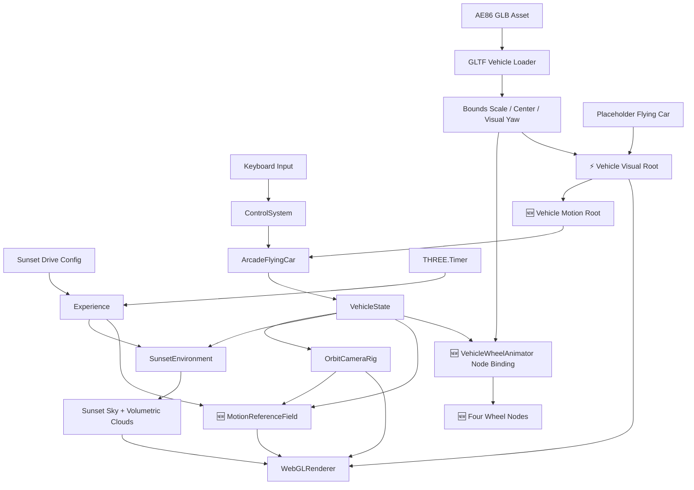
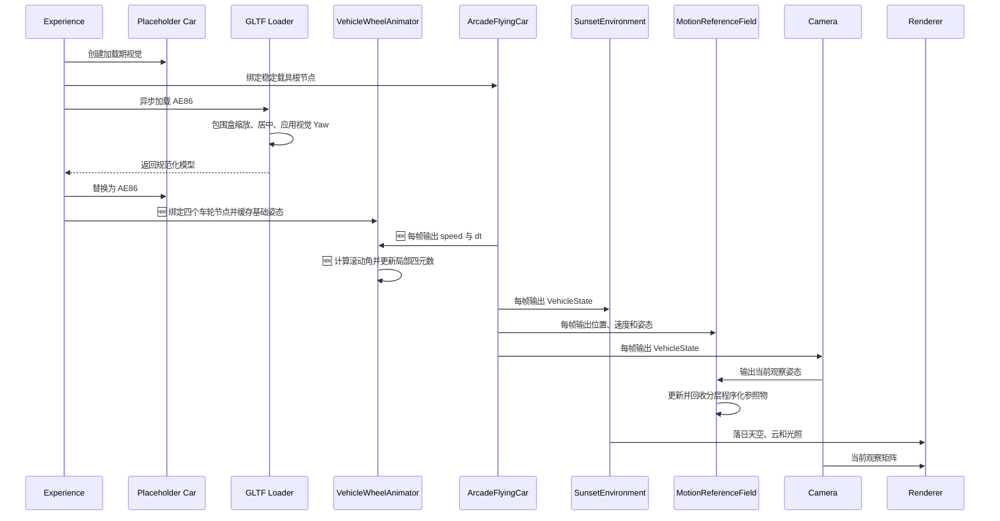

# 落日飞车场景原理文档

> ⚡ 2026-08-04：本场景架构已从运行时移除，仅保留历史设计记录。当前架构见 `docs/architecture/core-drive/README.md`。

## 1. 架构设计



## 2. 模块设计

| 模块 | 职责 | 输入 | 输出 |
|------|------|------|------|
| `Experience` | 组装落日环境、飞车、相机、HUD 和异步资源生命周期 | `ExperienceConfig`、Canvas | 可运行场景 |
| `SunsetEnvironment` | 管理落日天空、体积云、雾和暖色环境光 | 时间、相机、载具状态、质量档 | 环境 shader 与诊断快照 |
| `MotionReferenceField` | ⚡ 管理近场光流、中景成对发光短条和远景城市的固定容量对象池 | 载具状态、相机、质量档 | 分层世界视差与诊断快照 |
| `ArcadeFlyingCar` | 提供航向稳定、姿态回正的 arcade 飞车手感 | `FlightCommand`、`dt`、运动/视觉根节点 | `VehicleState` 与姿态诊断 |
| `loadVehicleModel` | 加载并规范化第三方 GLB | 模型 URL、目标长度、前向约定 | 居中且尺度稳定的模型根节点 |
| `VehicleWheelAnimator` | 🆕 从规范化模型中绑定四个 AE86 车轮节点，并按线速度驱动局部旋转 | 模型根节点、`speed`、`dt` | 保留基础姿态的车轮自转与绑定诊断 |
| `OrbitCameraRig` | 围绕飞车自由观察并跟随移动 | `VehicleState`、鼠标输入 | Camera transform |

## 3. 核心原理

- 🆕 主题从通用云端飞行切换为“落日中的 AE86 飞车”，但控制、相机和环境仍通过 `VehicleState` 解耦。
- ⚡ 载具使用稳定 motion root 和独立 visual root；占位车/GLB 只替换 visual root 子节点，自动侧倾与点头不会改变真实运动方向或控制引用。
- ⚡ 输入按日常方向直觉映射，并以世界上方向航向、受限俯仰、自动回正和协调侧倾替代无限累积的本地三轴旋转。
- 🆕 模型资源按 `public/models/vehicles/{vehicle}` 组织，运行时通过站点绝对路径访问；第三方许可与模型同目录保存。
- ⚡ GLB 原始单位不进入玩法层，加载器按包围盒缩放并居中；当前配置在独立视觉根节点上绕本地 Y 轴正向旋转 `180°`，不改变运动根节点与 `-Z` 推进方向。
- ⚡ AE86 资源没有动画轨道或语义化车轮名；GLB 原名中的 `.` 会被 `GLTFLoader` 清除，因此运行时按已验证名称绑定 `Circle005_10`、`Circle001_11`、`Circle002_12`、`Circle003_13`，缺失节点时降级为空绑定而不阻断模型显示。
- 🆕 四个车轮节点的枢轴位于轮心、局部 X 轴沿车轴。控制器保存加载时的基础四元数，并根据局部轴相对车身 X 轴的方向确定左右轮旋转符号，避免镜像车轮反向滚动或累积姿态漂移。
- 🆕 车轮角速度由 `车辆线速度 / 轮胎半径` 得出；旋转角按整圈取模，每帧从基础姿态重新合成，模型加载和运动控制仍保持解耦。
- ⚡ 落日感由方向 `(0.32, 0.18, -0.93)` 的低角度太阳、暖色地平线、冷色高空和紫红云影共同构成，不依赖外部全景贴图。
- 🆕 体积云保留稀疏 coverage 与 Beer-Lambert 消光，避免落日染色后退化成整屏同色雾。
- 🆕 `THREE.Timer` 连接 Page Visibility API，避免切换标签页后出现大时间步，并消除旧 `Clock` 弃用警告。
- 🆕 程序化运动参照采用固定容量实例层，不新增 GLB 或贴图：近景表现速度，中景表现位移，远景表现方向和尺度。
- ⚡ 块状云层只由 `SunsetEnvironment` 的体积云生成；运动参照不再叠加局部云柱。
- ⚡ 中景参照不再使用椭圆航道门，只保留左右两列发光短条。
- ⚡ Orbit 相机在保留自由观察的同时加入速度前视、阻尼跟随和动态 FOV。

## 4. 核心数据结构

```typescript
interface ExperienceConfig {
  environmentId: string
  environmentLabel: string
  vehicleId: string
  vehicleModelUrl: string
  vehicleModelYawDegrees: number
  quality: 'low' | 'medium' | 'high'
}

interface VehicleVisualProfile {
  targetLength: number
  yawDegrees: number
  forwardAxis: '-Z'
  centerModel: boolean
}

interface WheelBinding {
  nodeName: string
  radius: number
  spinSign: 1 | -1
  baseRotation: Quaternion
}
```

## 5. 业务流程



## 6. 核心伪代码

```text
function 初始化落日飞车():
    1. 创建稳定的飞车运动根节点和占位车
    2. 创建 ArcadeFlyingCar、OrbitCameraRig 与 SunsetEnvironment
    3. 异步加载配置中的 AE86 GLB
    4. 按包围盒统一尺寸和中心，并在视觉根节点应用配置的 Y 轴角度
    5. 创建固定容量的近、中、远景运动参照实例层
    6. 成功时替换占位视觉，失败时保留占位车并记录错误

function 更新车轮旋转(speed, dt):
    1. 模型就绪时按已验证名称访问四个车轮节点
    2. 从车轮几何与世界缩放估算轮胎半径
    3. 根据左右镜像节点的局部轴方向记录旋转符号
    4. 累加 speed / radius * dt 并按整圈取模
    5. 从各节点基础四元数合成局部 X 轴旋转

function 渲染落日天空():
    1. 根据视线高度混合暖色地平线与冷色高空
    2. 在低角度太阳方向叠加日盘和辉光
    3. raymarch 稀疏体积云并计算消光
    4. 使用紫红阴影和金色受光面着色云体
    5. 输出落日天空、云层和地平线薄雾
```
