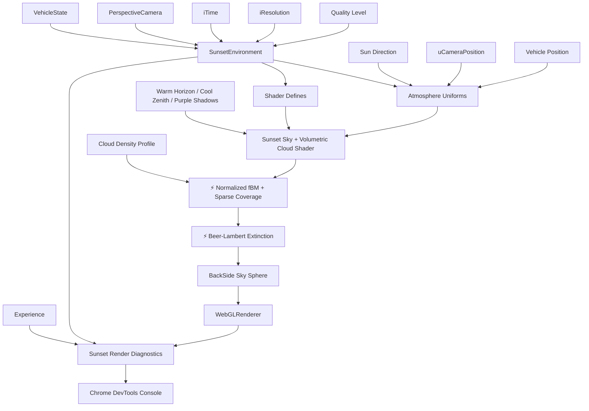
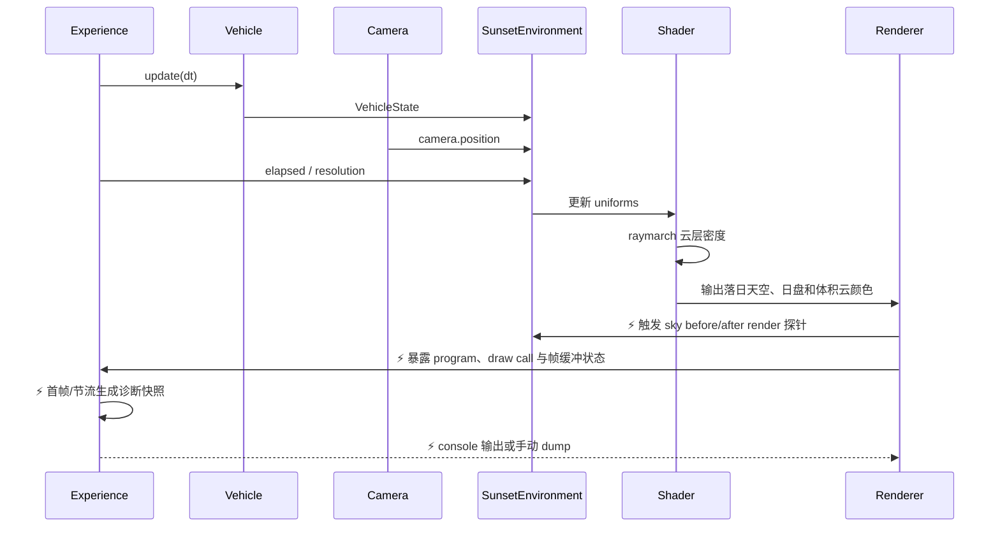

# 落日体积云原理文档

## 1. 架构设计



## 2. 模块设计

| 模块 | 职责 | 输入 | 输出 |
|------|------|------|------|
| `SunsetEnvironment` | 管理落日材质、暖色灯光、雾、uniforms 和密度诊断 | 时间、相机位置、载具状态、分辨率 | 更新后的 shader uniforms 与诊断快照 |
| `sunsetSky` | 生成落日天空、日盘、地平线和归一化稀疏体积云 | `iTime`、相机/载具位置、太阳方向、质量 defines、密度配置 | 落日天空 + 有空隙和体积边界的云层 |
| `OrbitCameraRig` | 提供自由观察相机位置 | 鼠标、`VehicleState` | `camera.position` |
| `VehicleState` | 驱动云层相对运动和空间参考 | 飞车位置 | `vehiclePosition` |
| `Sunset Render Diagnostics` | ⚡ 观测 CPU 到 GPU 的环境渲染边界，不改变 shader 输出 | 配置、uniforms、shader 编译、draw call、帧缓冲 | 分阶段 console 快照与手动 dump API |

## 3. 核心原理

- 🆕 不复制 Shadertoy 原代码；只采用体积云的通用思路：raymarch + fBM density + 简化光照。
- 🆕 当前实现为单 pass sky sphere shader，不使用 Buffer A / Image 多 pass。
- ⚡ 主题色由暖橙地平线、紫色过渡、深蓝高空、紫红云影和金色受光面构成；低角度太阳方向同时驱动天空日盘与 Three.js 方向光。
- 🆕 噪声使用原创 hash/value noise，避免依赖 Shadertoy 的 iChannel 噪声纹理资源。
- ⚡ 云层使用世界空间采样，当前由 `uCameraPosition` 决定视线起点；`vehiclePosition` 保留给后续近场云/尾流效果。
- ⚡ 自定义相机 uniform 命名为 `uCameraPosition`，避免和 Three.js 自动注入的 `cameraPosition` 冲突。
- ⚡ 体积云成本主要来自全屏 fragment raymarch；默认使用 `low` 质量，通过 shader defines 降低步数、噪声层数和二次采样。
- 🆕 光照使用沿太阳方向的少量二次采样估算亮边，不做物理正确散射。
- ⚡ 相机允许位于云层内部，因此可见性不能依赖云层外轮廓；密度场必须同时保留透明空隙和局部高密度云体。
- ⚡ fBM 按实际 octave 权重归一化，使 low/high 质量档的 coverage 阈值具有相同语义，避免增加 octave 后整体密度漂移。
- ⚡ coverage 只保留归一化 shape 的高值区，再用 medium noise 调制 billow；不再叠加无条件基础密度或额外饱和增益。
- ⚡ 每步透明度使用 Beer-Lambert 消光 `1 - exp(-density * distance * extinction)`，让累积结果对 raymarch 步长更稳定。
- ⚡ raymarch jitter 使用稳定的屏幕像素种子；时间只驱动世界空间风场，避免逐帧随机闪烁。
- ⚡ 云 shader 内部不能直接写入浏览器 console，因此诊断分布在 GPU 边界：编译输入、链接错误、材质 program、云球 draw callback、uniform 同步和最终帧缓冲像素。
- ⚡ 运行期日志必须节流：首帧记录完整证据，之后周期记录摘要，避免调试本身重新引入卡顿。

## 4. 核心数据结构

```typescript
interface SunsetAtmosphereUniforms {
  iTime: number
  iResolution: Vector2
  uCameraPosition: Vector3
  vehiclePosition: Vector3
  sunDirection: Vector3
  uAtmosphereDebugMode: 0 | 1 | 2
}

interface CloudSample {
  density: number
  lighting: number
  transmittance: number
}

interface CloudQualityDefines {
  CLOUD_MARCH_STEPS: number
  CLOUD_FBM_OCTAVES: number
  CLOUD_FAR_DISTANCE: string
  CLOUD_DETAIL_LIGHTING: 0 | 1
}

interface CloudDensityProfile {
  coverageStart: number
  coverageEnd: number
  billowStart: number
  billowEnd: number
  billowFloor: number
  detailInfluence: number
  extinction: number
}

interface SunsetRenderSnapshot {
  camera: PositionAndForward
  uniforms: CloudUniforms
  centerRayCloudSegment: RaySegment | null
  shaderProgram: ProgramStatus
  drawCalls: number
  framebufferSamples: PixelSample[]
}
```

## 5. 业务流程



## 6. 核心伪代码

```text
function 渲染落日云像素():
    1. 根据 sky sphere world direction 得到视线 rd
    2. 计算 ray 与云层高度范围的交段
    3. 归一化多 octave fBM，并以 coverage、billow 和高度遮罩生成稀疏 density
    4. 沿 ray 分步采样 density，以 Beer-Lambert 公式计算当前步消光
    5. 对有效密度点按质量档位估算简化太阳光照
    6. 按剩余透射率前向合成云颜色
    7. 混合暖色地平线、低角度太阳、冷色高空和远处雾化

function 诊断落日环境渲染():
    1. 启动时记录配置、WebGL 能力与云材质定义
    2. shader 编译时记录源码特征；失败时记录完整编译和链接日志
    3. 每次云球进入和完成 draw 时更新计数
    4. 首帧及节流周期校验相机、uniform、云层交段和 renderer program
    5. 渲染结束后读取少量帧缓冲像素，确认 GPU 最终输出
    6. 允许 DevTools 调用全局 dump API 获取同一份即时快照
```

## 7. GPU 诊断视图

| 模式 | 输出 | 用途 |
|------|------|------|
| `0` | 正常落日天空与体积云 | 默认运行，不改变用户画面 |
| `1` | ⚡ 云层交段颜色 | 区分“视线未命中云层”与后续 density/march 问题 |
| `2` | ⚡ 积分云透明度灰度 | 区分“有采样但合成不明显”与“density 始终为零” |

- ⚡ 调试视图只通过 `uAtmosphereDebugMode` 切换；正常模式的落日 RGB 合成流程保持不变。
