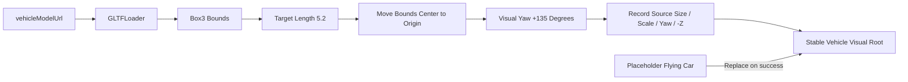

# AE86 模型接入记录

## 资源信息

| 项目 | 值 |
|------|----|
| 模型 | Toyota Corolla AE86 Trueno |
| 文件 | `public/models/vehicles/toyota-ae86/toyota-ae86-trueno.glb` |
| 作者 | Lexyc16 |
| 许可 | CC BY 4.0 |
| 格式 | 自包含 GLB 2.0，内嵌 PNG/JPEG |
| 扩展 | `KHR_materials_specular`、`KHR_materials_emissive_strength` |

完整来源和许可链接见同目录 `ATTRIBUTION.md`。

## 加载流程

## 规范化结果

- 🆕 glTF accessor 原始顶点范围还会受到根节点矩阵影响；规范化必须以 `Box3.setFromObject()` 的场景结果为准。
- 🆕 Three.js 场景包围盒尺寸约为 `4.238 x 2.891 x 9.656`。
- 🆕 目标长轴为 `5.2`，运行时 scale 约为 `0.53854`。
- 🆕 规范化尺寸约为 `2.282 x 1.557 x 5.2`，中心为 `(0, 0, 0)`，适配当前 orbit 距离。
- 🆕 模型长轴已沿 Z，运动控制器以本地 `-Z` 为前向；不额外修改 GLB 二进制。
- ⚡ 视觉根节点绕本地 Y 轴正向旋转 `135°`；运动根节点保持零初始旋转，因此只改变模型朝向，不改变初始飞行轨迹。
- 🆕 加载成功后释放占位车 geometry/material；加载失败时保留占位车并输出结构化错误。

## 验证

- ⚡ 文件与 attribution 均位于车型目录。
- ⚡ Vite 静态资源响应为 `200 model/gltf-binary`。
- ⚡ 项目 `GLTFLoader` 实际解析出 28 个 mesh、0 个动画；规范化函数返回预期尺寸和中心。
- ⚡ `yawDegrees: 135` 输出 `2.35619449` 弧度；旋转后 AABB 约为 `5.291 x 1.557 x 5.291`，中心误差保持在浮点精度范围内。
- ⚡ TypeScript/Vite 构建通过。
- ⚡ 浏览器会话不可用，材质呈现、车头方向与最终构图仍需在正常 WebGL 浏览器中确认。
