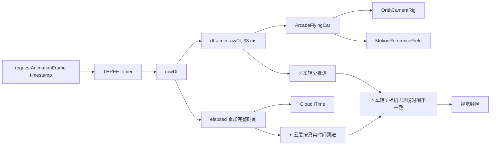
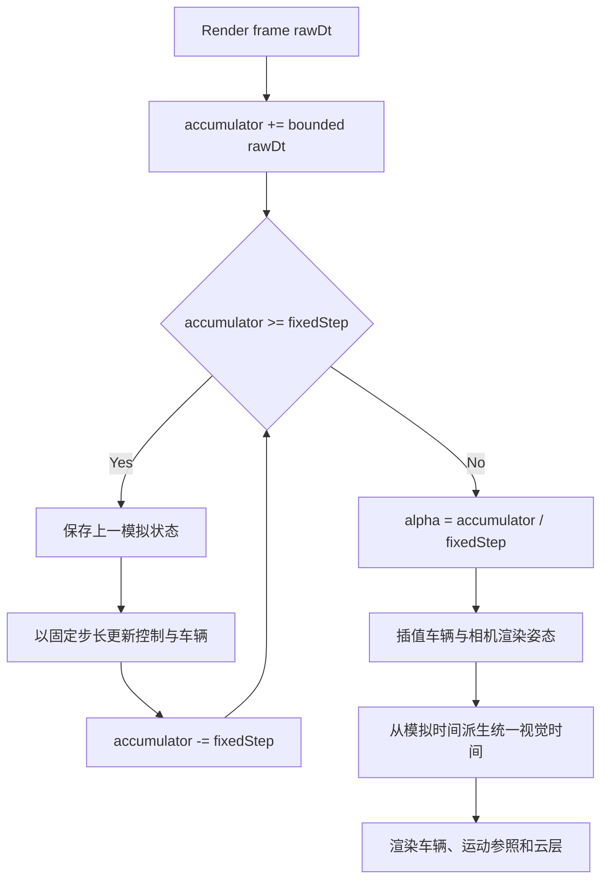

# 车辆帧步进顿挫问题记录

## 状态

- 🆕 当前状态：已确认，待修复。
- 🆕 用户影响：车辆和跟随相机在掉帧后出现短暂停顿，是当前视觉卡顿感的主要来源。
- 🆕 本文档只记录问题与后续方案，本轮不修改车辆、相机或时间步实现。

## 问题链路

## 根因

- 🆕 `Experience.tick()` 将车辆、车轮、相机和运动参照的 `dt` 最大限制为 `1 / 30` 秒。
- 🆕 `Timer.getElapsed()` 仍累加未截断的 `rawDt`，云层 shader 因此使用不同的时间进度。
- 🆕 当单帧超过 `33 ms` 时，车辆会丢弃部分真实时间；相机以车辆为跟随基准，因此车辆的不连续会扩大为整个画面的停顿感。
- 🆕 该限制可防止单次超大时间步导致物理爆炸，但它不是稳定的模拟器，也没有渲染插值来隐藏离散步进。

## 后续修复原则

1. 🆕 使用固定模拟步长，建议初始为 `1 / 60` 秒。
2. 🆕 为每个渲染帧限制最大模拟子步数，防止长帧后进入追帧螺旋。
3. 🆕 保存车辆前后两份模拟状态，渲染时插值位置和旋转；相机跟随插值后的渲染姿态。
4. 🆕 车轮、运动参照和 shader 时间必须从同一模拟时间派生，不再混用截断 `dt` 与完整 `elapsed`。
5. 🆕 固定步长只修复时间一致性和视觉步进；GPU 超预算仍由体积云质量与分辨率策略解决。

## 验收标准

- 人工注入 `33 / 50 / 100 ms` 长帧时，车辆位移与模拟时间一致，不出现单帧停住后恢复的顿挫。
- 相机、车辆、车轮和运动参照在固定 `30 FPS` 渲染下保持稳定速率。
- 云层风场与车辆渲染时间不发生可见分离。
- 长帧后的模拟子步数有上限，不发生 spiral of death。
- 至少进行 `60` 秒巡航、持续转向和加速联合验收，记录帧时分位与车辆位移连续性。
