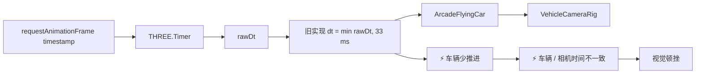
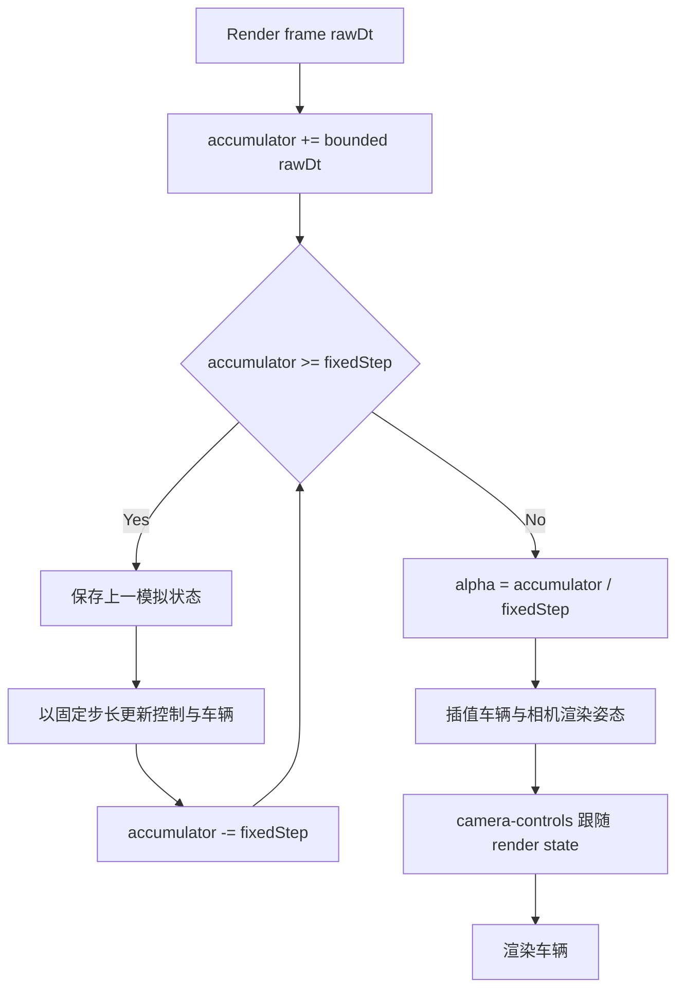

# 车辆帧步进顿挫问题记录

## 状态

- ⚡ 当前状态：固定步进与渲染插值已完成并通过验证。
- 🆕 用户影响：车辆和跟随相机在掉帧后出现短暂停顿，是当前视觉卡顿感的主要来源。
- ⚡ 2026-08-04 处理：删除高成本场景 shader 与程序化环境，并将帧时上限从 `1/30s` 放宽为 `0.1s`，车辆、车轮和相机继续共享同一帧时。
- ⚡ 2026-08-04 第二阶段：按用户指定流程引入 accumulator、`1/60s` 固定步、previous/current 快照、渲染插值与 camera-controls render-state 跟随。

## 问题链路

## 根因

- 🆕 `Experience.tick()` 将车辆、车轮、相机和运动参照的 `dt` 最大限制为 `1 / 30` 秒。
- 🆕 `Timer.getElapsed()` 仍累加未截断的 `rawDt`，云层 shader 因此使用不同的时间进度。
- 🆕 当单帧超过 `33 ms` 时，车辆会丢弃部分真实时间；相机以车辆为跟随基准，因此车辆的不连续会扩大为整个画面的停顿感。
- 🆕 该限制可防止单次超大时间步导致物理爆炸，但它不是稳定的模拟器，也没有渲染插值来隐藏离散步进。

## 实际修复

1. ⚡ 使用固定 `1 / 60` 秒模拟步长。
2. ⚡ 每个渲染帧最多执行 `8` 个模拟子步，防止长帧后进入追帧螺旋。
3. ⚡ 保存车辆前后两份完整模拟状态，渲染时插值位置、旋转、速度和视觉姿态；相机跟随插值后的渲染状态。
4. ⚡ 车轮在固定步推进模拟角度，并在渲染阶段使用同一 `alpha` 插值。
5. ⚡ camera-controls 使用 accepted render delta 更新用户交互，自动跟随只读取车辆 render state。

## 验收标准

- 人工注入 `33 / 50 / 100 ms` 长帧时，车辆位移与模拟时间一致，不出现单帧停住后恢复的顿挫。
- 相机、车辆和车轮在固定 `30 FPS` 渲染下保持稳定速率。
- 长帧后的模拟子步数有上限，不发生 spiral of death。
- 至少进行 `60` 秒巡航、持续转向和加速联合验收，记录帧时分位与车辆位移连续性。

## 验证记录

- 🆕 纯调度测试中 `33ms` 产生 `1` 步与 `0.98 alpha`，`50ms` 产生 `3` 步，`100ms` 产生 `6` 步，均无 dropped time。
- 🆕 `200ms` 输入限制为 `8` 步，明确丢弃约 `66.7ms`，子步预算不会失控。
- 🆕 固定 `30 FPS` 连续 60 秒得到 `3600` 个固定子步、`60s` 模拟时间、零 accumulator 与零 dropped time。
- 🆕 混合 `120/45/30/20 FPS` 帧时共 `1200` 帧，模拟步时间、accumulator 和 dropped time 与 raw time 守恒。
- 🆕 浏览器 `W+A` 集成测试中车辆 render/simulation gap 约为一个固定步，camera-controls 距离稳定为 `9.76`，车轮和姿态持续更新，`glError = 0` 且无异常事件。
- 🆕 移动端 `390 x 844` reset 构图完整，drawing buffer 与 CSS 视口一致，车辆状态有限且 `glError = 0`。
- ⚡ 用户复验发现车辆相对相机前后抖动；诊断确认 `setLookAt(..., false)` 后真实 camera 延迟一帧写入，帧位移随 `alpha` / 子步数变化而形成屏幕深度振荡。
- 🆕 相机改为共享 interpolated vehicle 的 render-position delta，并在 `setLookAt` 后执行 `update(0)`；混合 `0/1/2` 子步的 90 帧采样中车到相机距离与观察深度 range 均为 `0`。
